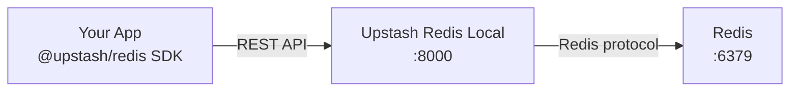

Upstash Redis Local is a lightweight HTTP proxy that connects your apps to a real Redis instance while speaking the same [Upstash REST API](https://upstash.com/docs/redis/features/restapi) your production code already uses.

Develop against `@upstash/redis` without burning cloud quota, hitting daily limits, or paying per request.

<CardGroup cols={2}>
  <Card title="Quickstart" icon="rocket" href="/quickstart">
    Get running in under 2 minutes with Docker.
  </Card>
  <Card title="Switch from Cloud" icon="cloud-arrow-down" href="/guides/switch-from-cloud">
    Point your app at localhost — zero code changes.
  </Card>
  <Card title="API Reference" icon="code" href="/api-reference/introduction">
    Full REST endpoint documentation.
  </Card>
  <Card title="Dashboard" icon="chart-line" href="/guides/dashboard">
    Track requests and cloud quota saved.
  </Card>
</CardGroup>

## Why use this?

| Cloud Upstash | Upstash Redis Local |
| --- | --- |
| 10,000 commands/day (free tier) | **Unlimited** |
| Pay per request | **Free** |
| Rate limits under load | **No throttling** |
| Shared prod credentials | **Isolated local data** |

<Note>
  This is a **local development tool**, not a replacement for Upstash Cloud in production. Use it during dev, testing, and CI — then deploy to [Upstash Cloud](https://upstash.com) for production.
</Note>

## How it works

Your app sends HTTP requests to `localhost:8000`. The Go server translates them into native Redis commands — same SDK, same API shape, zero cloud calls.

## Key features

- **Full REST API** — commands, pipeline, multi-exec, pub/sub, monitor
- **Read-only tokens** — like Upstash Cloud's readonly token
- **Usage dashboard** — see how many cloud requests you've saved
- **Rate-limit simulator** — test fallback logic without touching cloud
- **CLI tools** — seed, export, import, env switching
- **Docker profiles** — bundled Redis, external Redis, Redis Stack
- **CORS enabled** — browser and edge runtime dev
- **Tiny image** — ~10MB Alpine-based container

## What's next?

<Steps>
  <Step title="Install">
    Run `./start.sh` or `docker compose up -d`. See [Docker installation](/installation/docker).
  </Step>
  <Step title="Configure your app">
    Set `UPSTASH_REDIS_REST_URL=http://localhost:8000`. See [Switch from Cloud](/guides/switch-from-cloud).
  </Step>
  <Step title="Verify">
    Open the [dashboard](http://localhost:8000/dashboard) or run [manual tests](/testing/manual).
  </Step>
</Steps>
